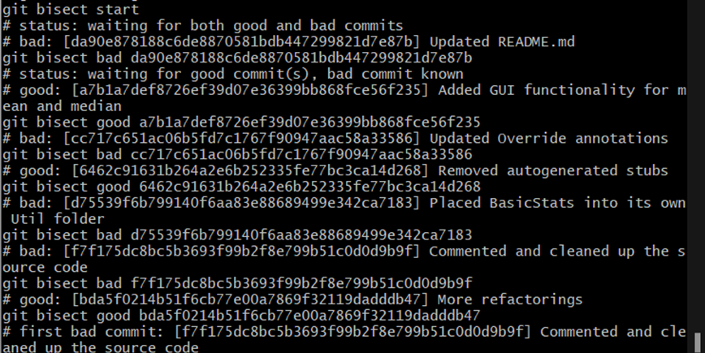

1. Why does the described automated testing infrastructure not catch the defect?

    In Junit the attribute "haltonfailure=false" we used in the build.xml file means that, even if tests fail, the build would continue and exit with an 0 code since the build itself is completed successfully. If we want to get non 0 code when there's a test failure, we should assign true to haltonfailure. 


2. How could the developers improve the testing infrastructure (either manual or automated) to immedi- ately notice test failures in the future?

    One way to fix the issue is, like the solution above, set the value of haltonfailure attribute to true. Another way to solve it, although it might require some more labor, is to improve the notification mechanism. Send email with log messages included even if all tests passed, so people might notice if they check their email inbox regularly.

3. For git bisect, how many commits exist between v1.0.0 and the HEAD revisions (including v1.0.0 and HEAD)? What command(s) did you use to determine the number?

    There are 37 commits between v1.0.0 and HEAD.
    We use command `git log v1.0.0^...HEAD --oneline | wc -l`.
      
4. Based on the git bisect results, which commit (commit hash and log message) introduced the defect? How did you independently verify (meaning another approach other than git bisect) that this commit indeed introduced the defect?

    f7f175dc8bc5b3693f99b2f8e799b51c0d0d9b9f is the first bad commit
    ```
    git checkout f7f175dc8bc5b3693f99b2f8e799b51c0d0d9b9f^
    ant clean test 

    The version before the claimed first bad commit should pass all the tests. 
    ```

5. In interactive mode in git bisect, after how many steps (git bisect calls) did you identify the defect-inducing commit?
   
   It took a total of 8 git bisect calls to identify the defect-inducing commit. The following figure illustrates the 8 calls (including the git bisect start).

   

6. Which git command can you use to undo the defect-inducing commit? Briefly explain what problem may occur when undoing a commit and what best practice generally mitigates this problem.

    We can use revert, as it undoes the changes of one single commit and also does not removes it from the history. Revert makes a new commit object with identical content to a previous commit but with a different parent commit object and hash. This does not alter the commit history and is safe even if other repos are tracking a branch - you are only adding to the commit history and thus will not be removing commits that others depend upon.
    
    When we are undoing a commit the problem that might occur is, some of the files that are not having any bugs and were updated in the commit might also get changed (due to revert) in the main branch itself.

    So a safer/best practice to perform a revert operation is to create a new branch - `rev_bug`. In this new branch we perform the revert operation, which can lead to removal of some files or content of some files. We then merge this branch with the main branch - where we have to resolve some merge conflicts in a way that we keep the contents same for all files, and only the bug infected portion is rectified.  
    
    